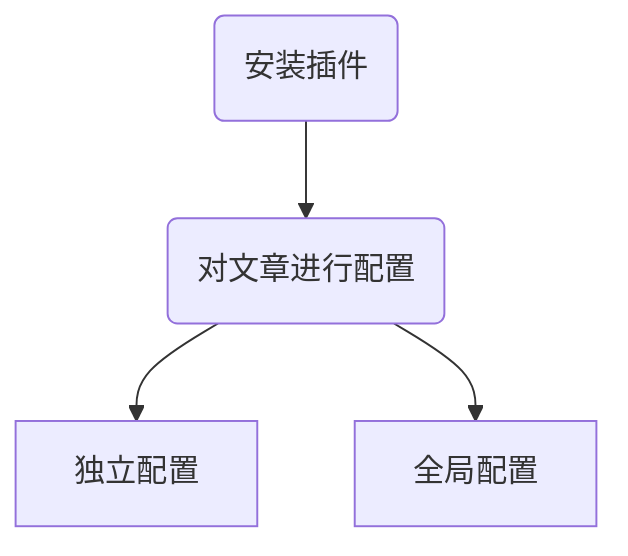

#### 前言

- 你可能需要写一些私密的博客, 通过密码验证的方式让人不能随意浏览.

- 这在 wordpress, emlog 或是其他博客系统中都很容易实现, 然而 hexo 除外. 😦

- `hexo-blog-encrypt`插件就能很好地解决这个问题.

#### 特性

- 一旦你输入了正确的密码, 它将会被存储在本地浏览器的 localStorage中. 按个按钮, 密码将会被清空. 若博客中又脚本, 它将会被正确地执行.
- 支持按标签加密.
- 所有的核心功能都是由原生的 API 所提供的. 在 Node.js中, 我们使用 Crypto. 在浏览器中, 我们使用 Web Crypto API.
- PBKDF2, SHA256 被用于分发密钥, AES256-CBC 被用于加解密, 我们还使用 HMAC 来验证密文的来源, 并确保其未被篡改.
- 我们广泛地使用 Promise 来进行异步操作, 以此确保线程不被杜塞.
- 加密页面多主题支持, 现在已经支持的主题有 [default, xray], 更多的主题正在开发中.
- 过时的浏览器将不能正常显示, 因此, 请升级您的浏览器.

#### 在线演示

- 点击 [Demo Page](https://mhexo.github.io/), **所有的密码都是 `hello`**.

#### 安装

- `npm install --save hexo-blog-encrypt`
- 或`yarn add hexo-blog-encrypt`(需要[Yarn](https://yarnpkg.com/en/))

##### 快速使用

- 将 “`password`” 字段添加到您文章信息头就像这样.

```tex
---
title: Hello World
date: 2016-03-30 21:18:02
password: hello
---
```

- 再使用 `hexo clean && hexo g && hexo s` 在本地预览加密的文章.

#### 设置优先级

文章信息头 > 按标签[加密](https://so.csdn.net/so/search?q=加密&spm=1001.2101.3001.7020)

#### 高级设置

#### 文章信息头

```tex
---
title: Hello World
tags:
- 作为日记加密
date: 2016-03-30 21:12:21
password: mikemessi
abstract: 有东西被加密了, 请输入密码查看.
message: 您好, 这里需要密码.
wrong_pass_message: 抱歉, 这个密码看着不太对, 请再试试.
wrong_hash_message: 抱歉, 这个文章不能被校验, 不过您还是能看看解密后的内容.
---
```

##### `_config.yml`

示例：

```javascript
# Security
encrypt: # hexo-blog-encrypt
  abstract: 有东西被加密了, 请输入密码查看.
  message: 您好, 这里需要密码.
  tags:
  - {name: tagName, password: 密码A}
  - {name: tagName, password: 密码B}
  wrong_pass_message: 抱歉, 这个密码看着不太对, 请再试试.
  wrong_hash_message: 抱歉, 这个文章不能被校验, 不过您还是能看看解密后的内容.
```

#### 对博文禁用 Tag 加密

只需要将博文头部的 `password` 设置为 `""` 即可取消 Tag 加密.

示例：

```javascript
---
title: Callback Test
date: 2019-12-21 11:54:07
tags:
    - A Tag should be encrypted
password: ""
---

Use a "" to diable tag encryption.
```

#### 配置优先级

文章信息头 > _config.yml (站点根目录下的) > 默认配置

#### 关于 Callback 函数

在部分博客中, 解密后部分元素可能无法正常显示或者表现, 这属于已知问题. 目前的解决办法是通过自行查阅自己的博客中的代码, 了解到在 onload 事件发生时调用了哪些函数, 并将这些函数挑选后写入到博客内容中. 如：

```javascript
---
title: Callback Test
date: 2019-12-21 11:54:07
tags:
    - Encrypted
---

This is a blog to test Callback functions. You just need to add code at the last of your post like following:

It will be called after the blog decrypted.

<script>
    // 添加一个 script tag 与代码在文章末尾.
    alert("Hello World");
</script>
```

例子在: Callback 例子.

#### 对 TOC 进行加密

如果你有一篇文章使用了 TOC，你需要修改模板的部分代码。这里用 landscape 作为例子：

- 你可以在 hexo/themes/landscape/layout/_partial/article.ejs 找到 article.ejs。
- 然后找到 <% post.content %> 这段代码，通常在30行左右。
- 使用如下的代码来替代它:

```javascript
<% if(post.toc == true){ %>
  <div id="toc-div" class="toc-article" <% if (post.encrypt == true) { %>style="display:none" <% } %>>
    <strong class="toc-title">Index</strong>
      <% if (post.encrypt == true) { %>
        <%- toc(post.origin, {list_number: true}) %>
      <% } else { %>
        <%- toc(post.content, {list_number: true}) %>
      <% } %>
  </div>
<% } %>
<%- post.content %>
```

#### 禁用 Log

If you want to disable the logging, you can add a silent property in _config.yml and set it to true. 如果你想要禁止使用 Log, 你可以在 _config.yml 中增加一个 silent 属性, 并将其设置为 true.

```javascript
# Security
encrypt: # hexo-blog-encrypt
  silent: true
```

这样就会禁止如 `INFO hexo-blog-encrypt: encrypting "{Blog Name}" based on Tag: "EncryptedTag"`. 的日志.

#### 加密主题

之前, 我们尝试使用 `template` 关键字来让用户能修改自己的主题. 后来发现真不是一个好主意. 所以我们现在引入了主题: theme 关键字.

你可以简单的使用 `theme` 在 `_config.yml` 里或者文章头, 如下:

##### 文章信息头：

```javascript
---
title: Hello World
tags:
- 作为日记加密
date: 2016-03-30 21:12:21
password: mikemessi
abstract: 有东西被加密了, 请输入密码查看.
message: 您好, 这里需要密码.
theme: xray
wrong_pass_message: 抱歉, 这个密码看着不太对, 请再试试.
wrong_hash_message: 抱歉, 这个文章不能被校验, 不过您还是能看看解密后的内容.
---
```

##### 在 `_config.yml`

#### 示例

```tex
# Security
encrypt: # hexo-blog-encrypt
  abstract: 有东西被加密了, 请输入密码查看.
  message: 您好, 这里需要密码.
  tags:
  - {name: tagName, password: 密码A}
  - {name: tagName, password: 密码B}
  theme: xray
  wrong_pass_message: 抱歉, 这个密码看着不太对, 请再试试.
  wrong_hash_message: 抱歉, 这个文章不能被校验, 不过您还是能看看解密后的内容.
```

#### 结语

`hexo-blog-encrypt`仓库地址：https://github.com/D0n9X1n/hexo-blog-encrypt/


本文包含两部分



